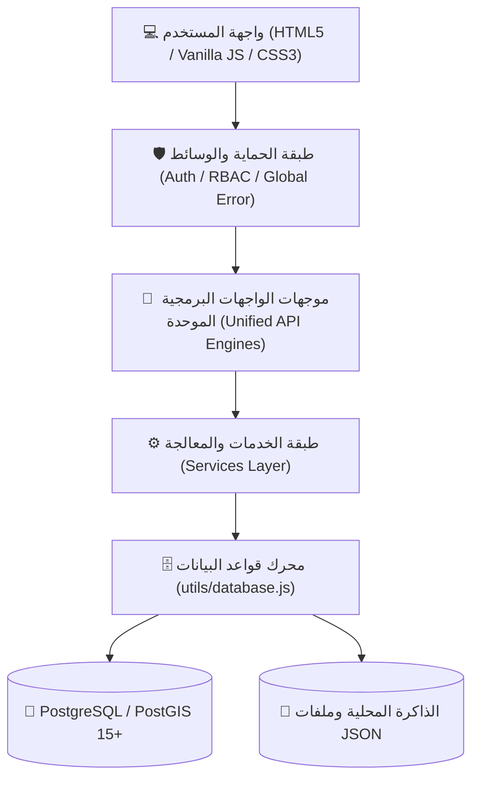

# 🏛️ الدليل الشامل لمعمارية وملفات نظام إدارة الأشغال والخدمات الهندسية (الموحد بعد الدمج والتنظيف)
## بلدية كفرنجة الجديدة - الإصدار v1.0

---

## 📌 1. نظرة عامة على المعمارية الموحدة (Unified Architecture)

تم إجراء عملية **تدقيق شامل ودمج وتطهير كامل لكافة المجلدات الفارغة والأكواد المتكررة والملفات المزدوجة** ليصبح النظام معتمداً على بنية واضحة ومباشرة:

---

## 📂 2. الملفات الرئيسية في جذر المشروع (Root Files)

| الملف | الوصف والمحتوى البرمجي | الوظائف والمهام الرئيسية |
| :--- | :--- | :--- |
| [`server.js`](file:///d:/28-7/28-7/نظام%20ادارة%20المشاريع/نظام%20ادارة%20المشاريع%208/server.js) | الخادم الرئيسي (Node.js / Express Server). | تهيئة الاتصال بـ PostgreSQL، إدارة جلسات الدخول والتوثيق (JWT)، وتوجيه طلبات العطاءات، المطالبات، المشتريات، المهام، والمستخدمين. |
| [`app.js`](file:///d:/28-7/28-7/نظام%20ادارة%20المشاريع/نظام%20ادارة%20المشاريع%208/app.js) | المتحكم الرئيسي للواجهة من جانب العميل (Client Controller). | إدارة التبديل بين الشاشات والتبويبات، رسم المخططات البيانية (Chart.js)، وإدارة النوافذ المنبثقة. |
| [`index.html`](file:///d:/28-7/28-7/نظام%20ادارة%20المشاريع/نظام%20ادارة%20المشاريع%208/index.html) | الهيكل العام لواجهة التطبيق الرئيسية (Main SPA Shell). | يحتوي على الشريط الجانبي، الترويسة، قوالب الشاشات، وأماكن حقن الخرائط الجغرافية والتقارير. |
| [`login.html`](file:///d:/28-7/28-7/نظام%20ادارة%20المشاريع/نظام%20ادارة%20المشاريع%208/login.html) | شاشة تسجيل الدخول الموحدة للكوادر الهندسية والإدارية. | التحقق من صحة المستخدم وتوليد رمز الدخول المشفر (JWT). |
| [`styles.css`](file:///d:/28-7/28-7/نظام%20ادارة%20المشاريع/نظام%20ادارة%20المشاريع%208/styles.css) | ورقة الأنماط المركزية للنظام. | الهوية البصرية، التصميم المتجاوب، وتنسيقات الجداول والطباعة الرسمية. |
| [`package.json`](file:///d:/28-7/28-7/نظام%20ادارة%20المشاريع/نظام%20ادارة%20المشاريع%208/package.json) | ملف تعريف الحزمة والاعتماديات. | إدارة أوامر التشغيل وحزم Express, PG, JWT, Bcrypt. |
| [`run.bat`](file:///d:/28-7/28-7/نظام%20ادارة%20المشاريع/نظام%20ادارة%20المشاريع%208/run.bat) | مشغل النظام بنقرة واحدة لبيئة Windows. | تشغيل الخادم وفتح المتصفح تلقائياً على المنفذ 3005. |
| [`SOP_DEPLOYMENT.md`](file:///d:/28-7/28-7/نظام%20ادارة%20المشاريع/نظام%20ادارة%20المشاريع%208/SOP_DEPLOYMENT.md) | دليل التشغيل والنشر القياسي. | إرشادات التشغيل وضبط متغيرات البيئة `.env` وسياسات قواعد البيانات. |

---

## 📁 3. الوحدات الوظيفية الموحدة (Active Functional Modules)

### 1️⃣ وحدة إدارة العقود والضمانات (`Contracts/`)
* **[`Contracts/API/contractManagementEngine.js`](file:///d:/28-7/28-7/نظام%20ادارة%20المشاريع/نظام%20ادارة%20المشاريع%208/Contracts/API/contractManagementEngine.js)**:
  - محرك API الموحد لإدارة دورة حياة العقود، توليد البنود القانونية، متابعة الكفالات، وحساب البصمة الرقمية SHA-256.
* **[`Contracts/Pages/unifiedContractManagementManager.js`](file:///d:/28-7/28-7/نظام%20ادارة%20المشاريع/نظام%20ادارة%20المشاريع%208/Contracts/Pages/unifiedContractManagementManager.js)**:
  - واجهة المستخدم التفاعلية لإنشاء وتعديل وطباعة العقود والضمانات.

---

### 2️⃣ وحدة إدارة الطرق وشبكات النقل (`Roads/`)
* **[`Roads/API/roadsEngine.js`](file:///d:/28-7/28-7/نظام%20ادارة%20المشاريع/نظام%20ادارة%20المشاريع%208/Roads/API/roadsEngine.js)**:
  - محرك API الموحد لإدارة شبكة الطرق (RAMS) والبيانات الجغرافية (GeoJSON) وحساب مؤشر حالة الرصفة (PCI).
* **[`Roads/Pages/unifiedRoadsManager.js`](file:///d:/28-7/28-7/نظام%20ادارة%20المشاريع/نظام%20ادارة%20المشاريع%208/Roads/Pages/unifiedRoadsManager.js)**:
  - واجهة المستخدم لسجل شبكة الطرق وعرض الخرائط وتوثيق عيوب الرصفات.
* **[`Roads/Pages/ramsDashboard.js`](file:///d:/28-7/28-7/نظام%20ادارة%20المشاريع/نظام%20ادارة%20المشاريع%208/Roads/Pages/ramsDashboard.js)**:
  - لوحة قيادة مؤشرات أداء شبكة الطرق وتوزيع ميزانيات الصيانة.
* **[`Roads/Services/index.js`](file:///d:/28-7/28-7/نظام%20ادارة%20المشاريع/نظام%20ادارة%20المشاريع%208/Roads/Services/index.js)** & **[`Roads/Segments/index.js`](file:///d:/28-7/28-7/نظام%20ادارة%20المشاريع/نظام%20ادارة%20المشاريع%208/Roads/Segments/index.js)**:
  - خدمات حساب المسافات وتقسيم المقاطع المتجانسة.

---

### 3️⃣ وحدة إدارة الأصول البلدية والهندسية (`Assets/`)
* **[`Assets/API/assetsEngine.js`](file:///d:/28-7/28-7/نظام%20ادارة%20المشاريع/نظام%20ادارة%20المشاريع%208/Assets/API/assetsEngine.js)**:
  - محرك RESTful الموحد لإدارة الأصول البلدية (الإنشائية، البنية التحتية، الإنارة والطاقة).
* **[`Assets/Pages/structuralAssets.js`](file:///d:/28-7/28-7/نظام%20ادارة%20المشاريع/نظام%20ادارة%20المشاريع%208/Assets/Pages/structuralAssets.js)**: منظومة الأبنية والجدران الاستنادية (SAMS).
* **[`Assets/Pages/infrastructureNetworks.js`](file:///d:/28-7/28-7/نظام%20ادارة%20المشاريع/نظام%20ادارة%20المشاريع%208/Assets/Pages/infrastructureNetworks.js)**: منظومة شبكات المياه وتصريف الأمطار (INAMS).
* **[`Assets/Pages/energyLighting.js`](file:///d:/28-7/28-7/نظام%20ادارة%20المشاريع/نظام%20ادارة%20المشاريع%208/Assets/Pages/energyLighting.js)**: منظومة شبكات الإنارة والطاقة (EMAMS).

---

### 4️⃣ وحدة عوائد التعبيد والتحققات المالية (`PavementReturns/`)
* **[`PavementReturns/API/pavingReturns.js`](file:///d:/28-7/28-7/نظام%20ادارة%20المشاريع/نظام%20ادارة%20المشاريع%208/PavementReturns/API/pavingReturns.js)**:
  - محرك الاحتساب المالي لعوائد التعبيد والتحقق البلدي على القطع والأحواض.
* **[`PavementReturns/Pages/pavingReturns.js`](file:///d:/28-7/28-7/نظام%20ادارة%20المشاريع/نظام%20ادارة%20المشاريع%208/PavementReturns/Pages/pavingReturns.js)**:
  - واجهة المستخدم لتسجيل التحققات وطباعة إخطارات التبليغ للمواطنين.
* **[`PavementReturns/Components/pavementManagementSubtabs.js`](file:///d:/28-7/28-7/نظام%20ادارة%20المشاريع/نظام%20ادارة%20المشاريع%208/PavementReturns/Components/pavementManagementSubtabs.js)**:
  - التبويبات الفرعية لربط عوائد التعبيد بالمخططات التنظيمية.

---

### 5️⃣ وحدة الإدارة والتصاريح والربط (`Administration/`)
* **[`Administration/API/workflowEngine.js`](file:///d:/28-7/28-7/نظام%20ادارة%20المشاريع/نظام%20ادارة%20المشاريع%208/Administration/API/workflowEngine.js)**:
  - محرك مسارات العمل والموافقات المتسلسلة.
* **[`Administration/API/g2gGateway.js`](file:///d:/28-7/28-7/نظام%20ادارة%20المشاريع/نظام%20ادارة%20المشاريع%208/Administration/API/g2gGateway.js)**:
  - بوابة الربط الحكومي للتبادل التكاملي للبيانات.
* **[`Administration/Pages/excavationPermits.js`](file:///d:/28-7/28-7/نظام%20ادارة%20المشاريع/نظام%20ادارة%20المشاريع%208/Administration/Pages/excavationPermits.js)**:
  - واجهة إصدار وتتبع تصاريح الحفر وتزويد الخدمات (EPAMS).

---

### 6️⃣ وحدة الإعدادات والهوية البصرية والتقارير (`Settings/` & `Reports/` & `GIS/`)
* **[`Settings/API/systemSettings.js`](file:///d:/28-7/28-7/نظام%20ادارة%20المشاريع/نظام%20ادارة%20المشاريع%208/Settings/API/systemSettings.js)**: حفظ واسترجاع إعدادات النظام وشعار البلدية والترويسات الرسمية.
* **[`Settings/Pages/visualIdentityManager.js`](file:///d:/28-7/28-7/نظام%20ادارة%20المشاريع/نظام%20ادارة%20المشاريع%208/Settings/Pages/visualIdentityManager.js)**: واجهة ضبط الهوية والأختام الرسمية.
* **[`Reports/Pages/printEngine.js`](file:///d:/28-7/28-7/نظام%20ادارة%20المشاريع/نظام%20ادارة%20المشاريع%208/Reports/Pages/printEngine.js)**: محرك الطباعة الموحد للتقارير الرسمية A4.
* **[`GIS/Pages/unifiedGisEngine.js`](file:///d:/28-7/28-7/نظام%20ادارة%20المشاريع/نظام%20ادارة%20المشاريع%208/GIS/Pages/unifiedGisEngine.js)**: مكتبة تهيئة وعرض خرائط Leaflet الموحدة.

---

## 🛡️ 4. طبقات الحماية والخدمات المساعدة (`middlewares/`, `services/`, `utils/`)

* **`middlewares/`**:
  - [`authMiddleware.js`](file:///d:/28-7/28-7/نظام%20ادارة%20المشاريع/نظام%20ادارة%20المشاريع%208/middlewares/authMiddleware.js): حماية مسارات API عبر الـ JWT Token.
  - [`rbacManager.js`](file:///d:/28-7/28-7/نظام%20ادارة%20المشاريع/نظام%20ادارة%20المشاريع%208/middlewares/rbacManager.js): مصفوفة الصلاحيات وتوزيع الأدوار (RBAC).
  - [`globalErrorHandler.js`](file:///d:/28-7/28-7/نظام%20ادارة%20المشاريع/نظام%20ادارة%20المشاريع%208/middlewares/globalErrorHandler.js): معالجة الاستثناءات الموحدة لحماية السيرفر من الانهيار.

* **`services/`**:
  - [`contractTemplateEngine.js`](file:///d:/28-7/28-7/نظام%20ادارة%20المشاريع/نظام%20ادارة%20المشاريع%208/services/contractTemplateEngine.js): محرك توليد نصوص العقود وتعبئة البنود التلقائية.
  - [`cryptoSignatureService.js`](file:///d:/28-7/28-7/نظام%20ادارة%20المشاريع/نظام%20ادارة%20المشاريع%208/services/cryptoSignatureService.js): توليد التواقيع المشفرة وبصمات SHA-256 للمحررات الرسمية.
  - [`spatialTranslator.js`](file:///d:/28-7/28-7/نظام%20ادارة%20المشاريع/نظام%20ادارة%20المشاريع%208/services/spatialTranslator.js): معالجة وتحويل الإحداثيات المكانية وحساب المسافات الجغرافية.
  - [`dataReconciliationService.js`](file:///d:/28-7/28-7/نظام%20ادارة%20المشاريع/نظام%20ادارة%20المشاريع%208/services/dataReconciliationService.js): مزامنة وتغذية قاعدة البيانات من البيانات المحلية.

* **`utils/`**:
  - [`database.js`](file:///d:/28-7/28-7/نظام%20ادارة%20المشاريع/نظام%20ادارة%20المشاريع%208/utils/database.js): مدير الاتصال المركزي بـ PostgreSQL مع دعم التراجع التلقائي للذاكرة.
  - [`localState.js`](file:///d:/28-7/28-7/نظام%20ادارة%20المشاريع/نظام%20ادارة%20المشاريع%208/utils/localState.js): الذاكرة المحلية المشتركة.
  - [`logger.js`](file:///d:/28-7/28-7/نظام%20ادارة%20المشاريع/نظام%20ادارة%20المشاريع%208/utils/logger.js): سجل الأحداث الأمنية وسجلات النظام المنظمة.

---

## 🧹 5. ما تم حذفه ودمجه لتنظيف وتوحيد النظام

1. **حذف المجلدات الهيكلية الفارغة (Empty Scaffoldings)**:
   - تم حذف المجلدات غير المستخدمة: `Maintenance/`, `Permissions/`, `Procurement/`, `Projects/`, `Tendering/`, `Users/`, `src/`, `backups/`, `routes/`, `public/`.
   - تم تنظيف كافة المجلدات الفرعية الفارغة غير المستخدمة داخل جميع الموديولات (`Components`, `Database`, `Documentation`, `Types`, `Utilities`, `Validation`, إلخ).
2. **دمج وإلغاء الملفات المزدوجة والمتكررة**:
   - تم حذف `Roads/API/roadsController.js` و `Roads/APIs/index.js` لاعتماد المحرك الموحد `roadsEngine.js` والمترجم المكاني `spatialTranslator.js`.
   - تم توحيد إدارة قواعد البيانات وسجلات التدوين في مجلد `utils/`.
3. **قرار معمارية الموديولات الهندسية (Modular Domain Architecture ADR)**:
   - تم اعتماد وتثبيت الهيكلية الموديلية المستقلة لموديولات مديرية الأشغال الـ 17 (مثل `Tenders`, `Contracts`, `Roads`, `Budget`, `Projects`, إلخ) في المجلد الرئيسي مباشرة، مع إبقاء تركيبة (`API/` للواجهات الخلفية و `Pages/` للواجهات التفاعلية) لكل موديول بشكل مستقل؛ لضمان استقرار مسارات الاستيراد النسبية (`../../utils/database`)، وتفادي كسر مسارات الرفع والـ Endpoints، وضمان التوافقية العكسية (Backward Compatibility) بنسبة 100%.
